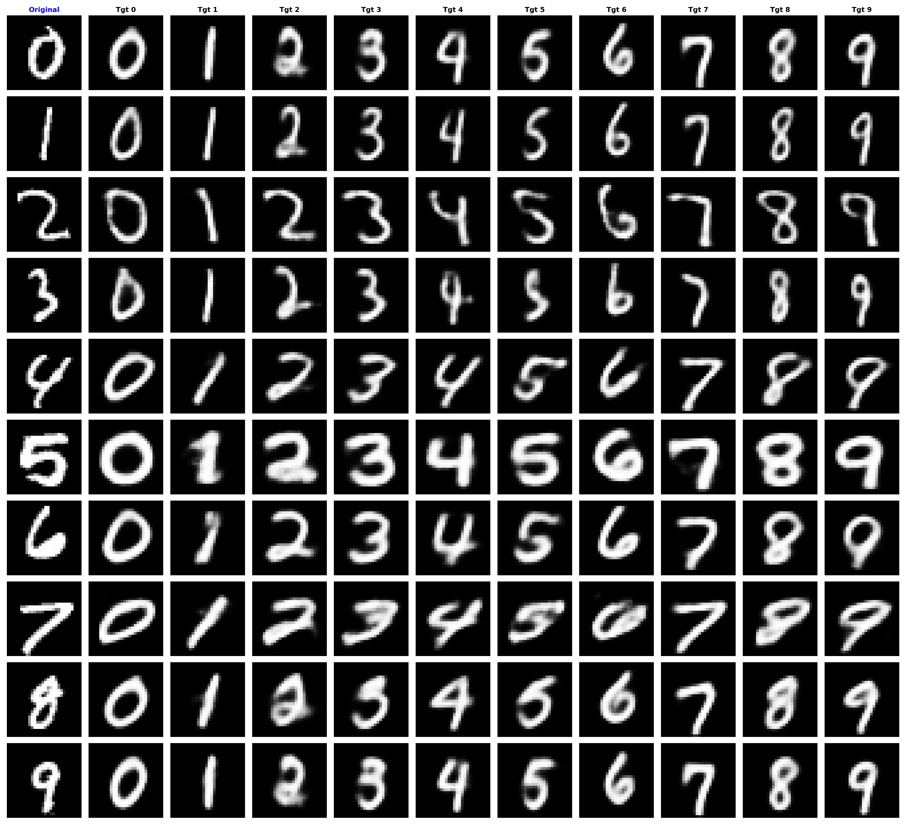
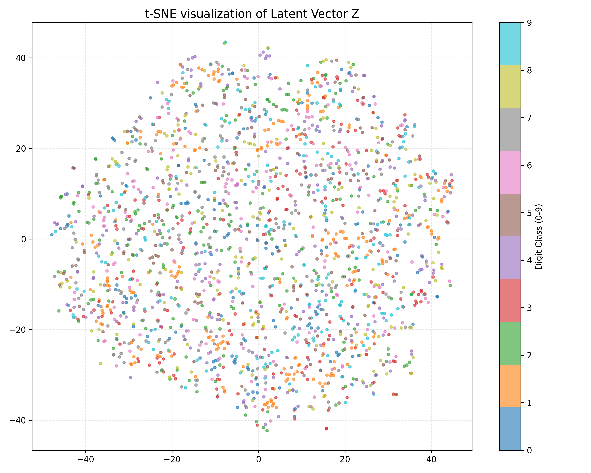
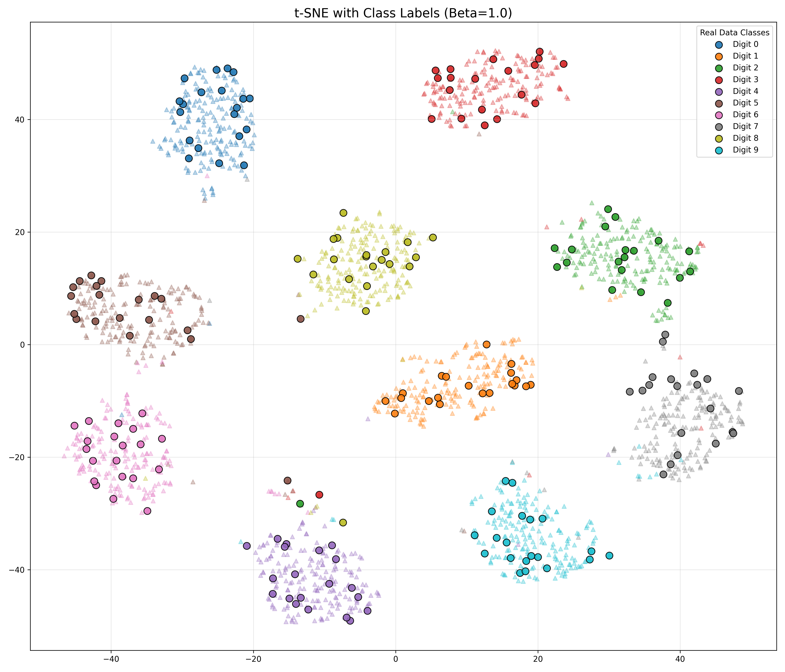

# Adversarial Causal Morph-VAE (MNIST)

### 1. Background and Objective

* **Ultimate Goal**
  : To analyze the effect of treatment conditions on vessel images and identify which morphological features are most important in distinguishing treatment responses.

* Before using real vessel data, the model structure designed was tested for logical validity using the MNIST dataset.

### 1.1. Data Mapping

| Variable | Role                   | MNIST Experiment (Current)                        | Bio Project (Final Goal)                       |
| -------- | ---------------------- | ------------------------------------------------- | ---------------------------------------------- |
| T        | Treatment              | Digit classes (0–9)                               | Treatment conditions                           |
| M        | Morphological features | Features like thickness, area, etc. (12 features) | Vascular thickness, length, branch count, etc. |
| X        | Image                  | Handwritten digit images                          | Vascular microscopy images                     |
| Z        | Other (Style)          | Handwriting style, noise                          | Imaging noise, background texture              |

### 2. Problem Definition and Solution

### 2.1. Limitations of Existing VAE (Entanglement)

Typical Variational Autoencoders (VAE) compress all image information into a single vector (Z).
In this case, **morphology (M)** and **style (Z)** become entangled.

* **Issue**
  : While images might be reconstructed clearly, the model cannot answer the question:
  *“Which specific features changed when condition T changed?”*

### 2.2. Solution: Element Separation

A strategy was adopted to separate interpretable morphological information (M) and uninterpretable residual style (Z) from the outset of the model structure.

### (1) Encoder: Extract Residual Information

* **Input**: X (image), M (morphology), T (condition)
* **Structure**: `Encoder(X, M, T) → Z`
* **Role**:
  The encoder extracts only the residual style (Z) by subtracting the part of X that can be explained by M and T, isolating the rest as Z.
* **Intent**:
  If M is not provided to the encoder, Z would learn morphological information as well.
  To prevent this, Z is isolated as a pure style unrelated to morphology.

### (2) Decoder: Two-Step Generation Process

The decoder works in two steps.

#### ① Morphology Prediction Stage

* **Input**: T (condition)
* **Output**: M′ (predicted morphology)
* **Meaning**:
  Estimates the “typical form” under the given condition.
  This represents the pure trend of the condition, free from noise.

#### ② Image Generation Stage

* **Input**: [M′, Z] (predicted morphology + isolated style)
* **Output**: X′ (reconstructed image)
* **Meaning**:
  Combines the predicted morphology (M′) with the isolated style (Z) to regenerate the actual image.

### (3) Adversarial Discriminator (LatentDiscriminator)

* **Structure**: `Discriminator(Z) → Pred_T`
* **Role**: 
  The discriminator tries to predict the condition T solely from the latent vector Z.
* **Adversarial Objective**:
  The VAE is trained to fool the discriminator (make it output a uniform distribution), ensuring Z contains **no information about T**.

### (4) Loss Function

$$
L_{Total} = L_{Recon} + \beta \times L_{KLD} + L_{Morph} + \lambda_{adv} \times L_{Adv}
$$

* **Reconstruction Loss**
  Minimizes the difference between input X and the reconstructed X′.
* **KL Divergence**
  Normalizes the distribution of Z.
* **Morphology Regression Loss**
  Minimizes the difference between predicted M′ and actual M.
* **Adversarial Confusion Loss** ($\lambda_{adv}$)
  Enforces Z to be independent of T by maximizing the entropy of the discriminator's prediction.

### (5) Hyperparameter Strategy

#### Key Hyperparameters

* **$\beta$ (KLD Weight) = 1.0**
  Reduced from 5.0 to 1.0 to prioritize high-quality image reconstruction (Sharpness).
* **$\lambda_{adv}$ (Adversarial Weight) = 10.0**
  A strong adversarial loss is added to compensate for the low $\beta$, ensuring Z remains disentangled from T.

As the Beta value increases (from 2 to 5 to 7), the original digit morphology is lost.

### 3. Verification Method and Results Interpretation

### 3.1. Virtual Intervention Experiment

Using the learned model (T → M relationship), a virtual intervention is performed.

* **Method**
  Fix the style (Z) of the original image and force condition (T) to change from 0 to 9.
* **Success Criteria**
  The generated image should change the digit (morphology) but retain the original handwriting style (style).
* **Result Interpretation**
  When changing condition T = A → B, we can observe how the predicted M′ values
  (e.g., thickness, area) change.

### 3.2. Latent Vector (Z) Visualization

* **Method**
  The extracted Z vectors are visualized using t-SNE.
* **Success Criteria**
  Z should not reflect digit information, so the points should be mixed regardless of digit class.
* **Failure Example**
  If the points cluster by digit, it implies that morphological information is still present in Z (entanglement).

### 3.3. Quantitative Evaluation Using an External Classifier

* **Method**
  The generated images are passed through an external classifier, and the obtained embedding vectors are clustered.

* **Note**
  Since the quality of the images varies significantly based on the β value,
  please consider this clustering result as a reference only.

* Circle: Actual (Real) image distribution

* Triangle: Generated (Fake) image distribution from condition change

### 3.4. Morphological Feature Importance

A larger difference (Diff) between predicted (M′) and original morphology (M) indicates key features that are crucial for distinguishing the condition (Top 3).

#### 1 (Source_Digit) → 2 (Target_Digit)

| Feature Name | Prediction | Original | Diff (Change) |
| ------------ | ---------- | -------- | ------------- |
| Perimeter    | 0.86       | 0.40     | 0.4610        |
| Eccentricity | 0.76       | 0.99     | 0.2362        |
| Solidity     | 0.56       | 0.77     | 0.2101        |

#### 1 (Source_Digit) → 8 (Target_Digit)

| Feature Name | Prediction | Original | Diff (Change) |
| ------------ | ---------- | -------- | ------------- |
| Euler Number | 0.26       | 0.75     | 0.4872        |
| Perimeter    | 0.87       | 0.40     | 0.4740        |
| Extent       | 0.50       | 0.34     | 0.1610        |

### 4. Limitations and Conclusion

### 4.1. Limitation: Deterministic Prediction

* **Phenomenon**
  The current structure assumes M = f(T), so when the same condition (e.g., digit 1) is input,
  only the average morphology is output.
* **Constraint**
  Fine morphological variability (variance) within the same digit is excluded from the model.

### 4.2. Conclusion and Expected Impact

Through this MNIST experiment, we validate the causal process where T changes, M changes,
and M combined with style Z generates images.

Once validated, this approach can be directly applied to real vessel data.

Ultimately, this can be used to backtrack and explain which morphological feature (M) changes most significantly when a treatment is administered, helping to elucidate the mechanism of action for the treatment.

### 5. Additional Materials
### 5.1. Selected Morphological Features Information (Total 16)

**1. Basic Geometry (5 features)**
* **Area**: `pixels / 784.0`
* **Thickness**: Max value of distance transform / 5.0
* **Solidity**: `Area / Convex_Hull_Area`
* **Aspect Ratio**: `(Width / Height) / 3.0` (Clipped)
* **Euler Number**: `(blobs - holes) / 4.0`

**2. Symmetry (2 features)**
* **H_Symmetry**: Horizontal Symmetry
* **V_Symmetry**: Vertical Symmetry

**3. Skeleton Topology (2 features)**
* **Endpoints**: Number of stroke endpoints / 5.0
* **Junctions**: Number of stroke intersections / 5.0
* *Role*: Captures the structural writing style of digits.

**4. Hu Moments (7 features)**
* **Hu1 ~ Hu7**: Log-transformed invariants.
* *Role*: Captures global shape characteristics invariant to scale and rotation.

### 5.2. All Intervention Results (10×10)

[All Intervention Results](./assets/01_intervention_matrix_beta1.0.csv)
