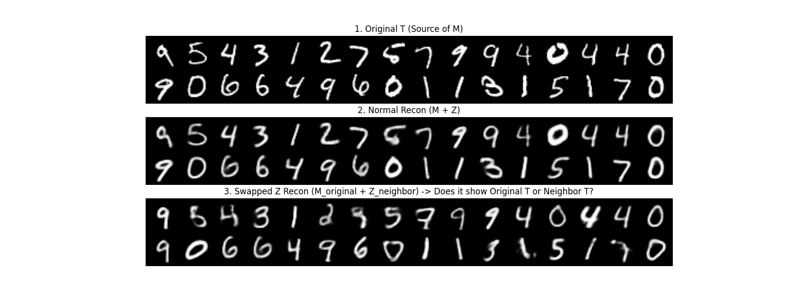

# 02. Mechanism Analysis (Prediction-Based Approach)

Following the baseline, this phase rigorously verifies the causal assumption: 

**"Is the defined morphological feature set ($M$) sufficient to explain the causal effect of condition ($T$) on image ($X$)?"**

## 1. Background & Hypothesis

In the previous phase, we established a VAE model based on the causal graph $T \rightarrow M \rightarrow X$.
model assumes that $M$ acts as a complete "blueprint" for generating $X$.

### The Core Question
Does $M$ capture **ALL** the information about $T$ needed to generate $X$?

*   **Hypothesis A ($T \rightarrow M \rightarrow X$)**: $M$ is the complete cause. Residuals ($X - \hat{X}$) should be pure noise.

## 2. Experiment 1: Residual Analysis (Incompleteness Check)

We analyzed the information lost during the $M \rightarrow X$ reconstruction process.

### Method
1.  Generate reconstructed images $\hat{X}$ from $(M, Z)$.
2.  Calculate Residuals: $R = |X - \hat{X}|$.
3.  **Residual Classifier**: Train a simple CNN to predict $T$ solely from $R$.

### Results
*   **Reconstruction**: Blurred images, missing fine details (stroke texture, exact curvature).
*   **Residual Classifier Accuracy**: **95.90%** (Very High)

### Interpretation
**Incomplete**
- Significant information about the digit identity ($T$) leaked into the residuals. The defined $M$ (16 features) is **incomplete** as a generative blueprint.

## 3. Experiment 2: Z-Permutation Test (Sufficiency Check)

If $M$ is incomplete, is it useless for causal analysis? We tested if $M$ still captures the *identity-defining* variance.

### Method
1.  Extract $M$ and $Z$ from a source image (e.g., "5").
2.  **Swap $Z$**: Replace the style vector $Z$ with one from a completely different image (e.g., a "9").
3.  Reconstruct $X_{new}$ using original $M$ + swapped $Z_{new}$.

### Results
*   The generated image retains the **digit identity ("5")** of the source $M$.
*   The handwriting style follows the swapped $Z_{new}$.

### Interpretation
**Sufficient**
- Even though $M$ misses details (residuals), it successfully captures the **condition-specific structural information** required to distinguish digits.

## 4. Quantitative Analysis: Feature Importance & Validation

We validated which features in $M$ are actually controlled by $T$.

### A. Mechanism Validation ($T \rightarrow M$ Accuracy)
We measured how well $T$ predicts each feature ($R^2$ Score).
*   **High $R^2$ (Valid)**: `Junctions` (0.85), `Euler Number` (0.81), `Endpoints` (0.75)
*   **Low $R^2$ (Invalid)**: `Hu Moments` (invariant features), `Aspect Ratio`
*   *Insight*: Topological features are the primary mediators of the causal effect.

### B. Top Causal Features
Based on sensitivity analysis (how much $M$ changes when $T$ changes):

| Rank | Feature Name | Role in Digit Definition |
| :--- | :--- | :--- |
| **1** | **Junctions** | Structural complexity (e.g., 8 vs 0, 4 vs 1) |
| **2** | **Euler Number** | Topology (Holes) |
| **3** | **Endpoints** | Stroke terminations |

## 5. Conclusion
1.  **$M$ is Incomplete**: It acts as a "Measurement" rather than a "Generator". We cannot perfectly restore pixels from $M$.
2.  **$M$ is Sufficient**: It captures the **variation caused by $T$** (Inter-group variance). The information in residuals is largely intra-group variance (individual style).
3.  **Implication**:
    *   We should **NOT** try to force perfect reconstruction by adding more complex $M$ (it leads to entanglement).
