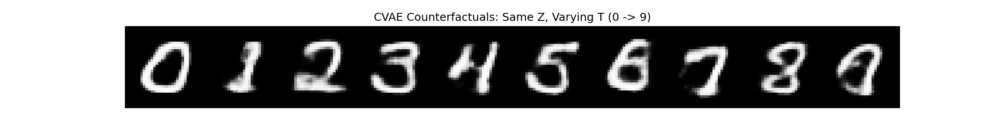

# 03. Measurement Approach (Generation-Based Analysis)

Following the failure of the prediction-based approach to fully capture the causal mechanism, this phase shifts to a **Generation-Based Analysis** ($T \rightarrow X \rightarrow M$).

## 1. Background & Hypothesis

In 02 ($T \rightarrow M$), we found that $M$ was "incomplete" for reconstruction but "sufficient" for classification. However, the prediction model might have used **shortcuts** or ignored features that are hard to predict but easy to measure.

### The Paradigm Shift
*   **From**: Predicting $M$ directly from $T$ (Indirect).
*   **To**: Generating $X$ from $T$, then **measuring** $M$ from $X$ (Direct).

**Why?**
- A generative model ($T \rightarrow X$) is forced to learn **all** structural details to generate a convincing image. By measuring $M$ on these generated images, we can capture the full causal effect of $T$ without information loss.

## 2. Methodology: T → X → M Pipeline

We use a **Conditional VAE (CVAE)** to model the causal process.

### Step 1: CVAE Training ($T \rightarrow X$)
*   **Model**: $P(X | Z, T)$
*   **Goal**: Generate images ($X$) directly from condition ($T$) and style ($Z$), bypassing $M$ during generation.
*   **Result**: The model learns to map specific digits ($T$) to their visual representations ($X$) while disentangling style ($Z$).

### Step 2: Counterfactual Generation
*   **Action**: Fix $Z$ (style) and sweep $T$ from 0 to 9.
*   **Outcome**: We generate "the same handwriting style" writing different digits. This isolates the pure causal effect of $T$.

### Step 3: Measurement & Sensitivity Analysis ($X \rightarrow M$)
*   **Measure**: Extract morphological features ($M_{measured}$) from the *generated* counterfactual images.
*   **Calculate Sensitivity**: $\text{Score} = \text{StdDev}(M_{measured} \text{ across } T)$
*   **Interpretation**: High sensitivity means $T$ heavily influences that feature.

## 3. Experiment Results

### A. Feature Importance
Phase 2 confirms that structural features are key, but also highlights the importance of global shape invariants (Hu Moments).

| Rank | Feature | Role | Phase 1 Rank |
| :--- | :--- | :--- | :--- |
| **1** | **Junctions** | Structural Complexity | 1 |
| **2** | **Hu7** | Skew/Asymmetry | Low |
| **3** | **Hu5** | Global Shape | Low |
| **4** | **Endpoints** | Stroke Terminations | 3 |
| **5** | **Euler Number** | Topology (Holes) | 2 |

**Key Finding**: 
1. **Junctions (Crossings)** remains the #1 most critical factor.
2. **Hu Moments (7 & 5)** jumped in importance. This suggests that when the model assumes the burden of *generation* ($T \rightarrow X$), it pays close attention to the **global shape balance and asymmetry** (features that simple prediction $T \rightarrow M$ might ignore).

### B. Validation of Generation
*   The CVAE successfully generates distinct digits while preserving style.
*   This proves that the **Structural Disentanglement** is successful in this direction ($T \rightarrow X$).

### C. Pairwise Analysis (Case Study: 1 vs 7)

We compared what the **Prediction Model (Phase 1)** thought was important versus what the **Generative Model (Phase 2)** actually produced.

| Feature | Phase 1 (Prediction) | Phase 2 (Measurement) | Interpretation |
| :--- | :--- | :--- | :--- |
| **Junctions** | **High Change** (+0.45) | **No Change** (0.0) | **Ambiguity**: Phase 1 predicts an *average* (mixing crossed & uncrossed 7s). Phase 2 generates a specific *instance* (uncrossed 7), which is visually verifiable. |
| **Solidity** | Moderate (-0.20) | **#1 Factor** | Phase 2 captures the "hollow" shape (acute angle) reliably. |
| **Hu Moments** | Moderate | **High Importance** | Phase 2 captures the global skew/asymmetry. |

## 4. Phase 1 vs Phase 2 Comparison

| Feature | Phase 1 (Prediction $T \rightarrow M$) | Phase 2 (Measurement $T \rightarrow X \rightarrow M$) |
| :--- | :--- | :--- |
| **Perspective** | $M$ is the "Blueprint" | $M$ is a "Measurement" |
| **Completeness** | Low (Residuals contain info) | **High** (Generated images are complete) |
| **Shortcut Risk** | High (Model can cheat) | **Low** (Must generate pixels) |
| **Conclusion** | $M$ acts as a sufficient summary | $M$ reflects the true causal downstream effect |
